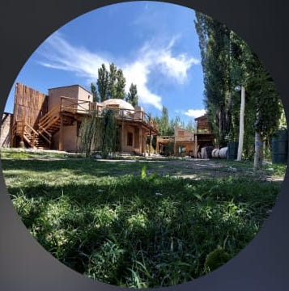

<div align="center">
  
  <h1>Almacén Natural Hunuc Pachacutek</h1>
  <p>Sistema de gestión de almacén estilo POS — productos, stock, ventas, caja, dashboards, auditoría y roles.</p>
</div>

---

## 🧱 Stack

| Capa | Tecnología |
|---|---|
| Framework | **Next.js 16** (App Router) + **React 19** + **TypeScript** estricto |
| Estilos | **TailwindCSS v4** + **shadcn/ui** (theme verde natural, dark/light) |
| Backend | **Supabase** (PostgreSQL + Auth + Realtime + RLS) |
| Datos (lectura) | **TanStack Query** (cache + Realtime) |
| Estado UI | **Zustand** (carrito POS persistente) |
| Formularios | **React Hook Form** + **Zod** |
| Mutaciones | **Server Actions** |
| Gráficos | **Recharts** · Excel/CSV: **SheetJS** |
| Gestor | **pnpm** |

## ✨ Funcionalidades

- **Autenticación** email + contraseña, con registro de sesiones (IP, dispositivo, navegador).
- **RBAC** (admin / vendedor) con doble enforcement: middleware (rutas) + **RLS** (datos).
- **Productos**: CRUD, búsqueda instantánea (índices trigram), filtros por categoría/productor/stock bajo, ajuste de stock con kardex, borrado lógico.
- **Importador Excel/CSV**: detecta columnas aunque estén desordenadas, limpia encabezados repetidos y banners, normaliza ~94 variantes de unidades, deriva productores (prefijo del código) y categorías (palabras clave), y marca productos a revisar.
- **POS**: búsqueda rápida, carrito, 3 métodos de pago (efectivo / transferencia / Mercado Pago), descuento, **venta atómica** (descuenta stock + kardex + caja + auditoría en una sola transacción) y ticket.
- **Caja**: apertura, ingresos/egresos, arqueo con cálculo de diferencia, movimientos en vivo.
- **Dashboards** role-aware con KPIs, gráfico de ventas, top productos, stock bajo, top vendedores y **métricas en tiempo real** (Realtime).
- **Auditoría** completa y **gestión de usuarios**.

## 🏛️ Arquitectura

Feature-based modular. Escrituras por **Server Actions** (validación Zod + auditoría); lecturas por **TanStack Query**; estado efímero en **Zustand**. La base de datos es la fuente de verdad de seguridad (RLS + funciones `SECURITY DEFINER` para operaciones atómicas).

```
src/
├── app/
│   ├── (auth)/login/            # login
│   └── (dashboard)/             # app protegida (sidebar + topbar)
│       ├── page.tsx             # dashboard role-aware
│       ├── pos/  products/  sales/  cash/
│       └── admin/{users,audit}/
├── features/                    # módulos: cada uno con api · hooks · actions · schemas · components
│   ├── auth/  products/  import/  sales/  cash/  dashboard/  audit/  users/
├── components/{ui,providers,shared,layout}/
├── lib/{supabase,query,rbac,auth}/  env.ts · constants.ts · units.ts · format.ts
├── stores/                      # zustand: cart, ui
└── types/                       # database.types.ts (generado) + db.ts (aliases)
supabase/
├── migrations/                  # 8 migraciones SQL versionadas
└── seed.sql                     # roles, sucursal, categorías
scripts/import-excel.ts          # seed del Excel real
```

## 🗄️ Base de datos

13 tablas con RLS: `roles`, `branches`, `profiles`, `categories`, `producers`, `products`, `stock_movements`, `sales`, `sale_items`, `cash_registers`, `cash_movements`, `audit_logs`, `sessions`. Funciones RPC atómicas: `create_sale`, `open/close_cash_register`, `add_cash_movement`, `adjust_stock`, y métricas (`dashboard_metrics`, `sales_daily_series`, `top_products`, `top_sellers`). Todo está preparado para **multi-sucursal** (`branch_id` desde el día 1).

## 🚀 Puesta en marcha

### 1. Requisitos
- Node 20+ y `pnpm` (`npm i -g pnpm`)
- Una cuenta en [supabase.com](https://supabase.com)

### 2. Instalar
```bash
pnpm install
```

### 3. Crear la base en Supabase
1. Creá un proyecto en supabase.com.
2. En **SQL Editor**, ejecutá **en orden** los archivos de `supabase/migrations/` (0001 → 0008) y luego `supabase/seed.sql`.
   > Alternativa con CLI: `supabase link --project-ref <ref> && supabase db push`.

### 4. Variables de entorno
Copiá `.env.example` → `.env.local` y completá con tus claves (Supabase → Settings → API):
```env
NEXT_PUBLIC_SUPABASE_URL="https://TU-PROYECTO.supabase.co"
NEXT_PUBLIC_SUPABASE_ANON_KEY="..."
SUPABASE_SERVICE_ROLE_KEY="..."          # solo server (seed, alta de usuarios)
NEXT_PUBLIC_DEFAULT_BRANCH_ID=""          # opcional (default: Casa Central del seed)
```

### 5. Crear el primer admin
En Supabase → **Authentication → Add user** (con email/contraseña). Luego, en SQL Editor, asignale rol admin:
```sql
update public.profiles
set role_id = (select id from roles where name = 'admin')
where email = 'TU-EMAIL';
```

### 6. Importar el catálogo real (opcional)
```bash
pnpm seed -- --dry     # vista previa del parseo, sin tocar la DB
pnpm seed              # importa el Excel a Supabase
```
También podés importar desde la app en **Productos → Importar**.

### 7. Desarrollo
```bash
pnpm dev        # http://localhost:3000
pnpm build      # build de producción
pnpm typecheck  # chequeo de tipos
pnpm db:types   # regenerar tipos desde Supabase (requiere supabase link)
```

## ☁️ Deploy en Vercel

1. Subí el repo a GitHub y en [vercel.com](https://vercel.com) → **New Project** → importá el repo (detecta Next.js + pnpm).
2. Cargá las variables de entorno (las mismas de `.env.local`) en **Project Settings → Environment Variables**.
3. En Supabase → **Authentication → URL Configuration**, agregá la URL de Vercel a *Site URL* y *Redirect URLs*.
4. **Deploy**. Cada push a `main` redeploya automáticamente.

## 🗺️ Roadmap futuro (preparado en la arquitectura)
Tickets PDF · lector de código de barras (campo `barcode` listo) · múltiples sucursales (`branch_id` en todas las tablas) · estadísticas avanzadas · app móvil (API ya desacoplada) · impresoras térmicas.

---

<div align="center"><sub>Hecho con 🌱 para Hunuc Pachacutek</sub></div>
